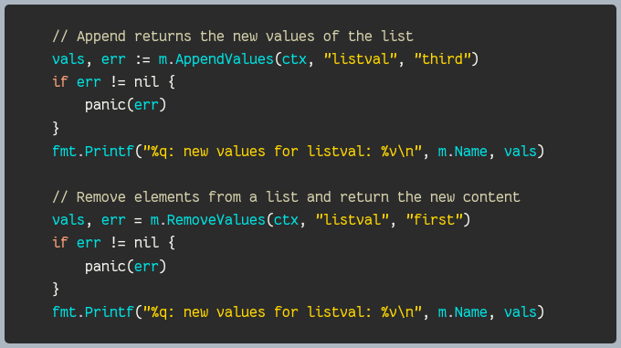

# Replicated Map

Replicated maps provide a mechanism for sharing data across a fleet of
microservices.

## Overview

Pulse replicated maps leverage Redis hashes and pub/sub to maintain replicated
in-memory copies of a map across multiple nodes. Any change to the map is
automatically replicated to all nodes and results in a notification that can be
used to trigger actions.

Upon joining a replicated map the node receives an up-to-date snapshot of its
content. The replicated map then guarantees that any change to the map results
in a notification.

## Usage

### Creating a Replicated Map

To create a replicated map you must provide a name and a Redis client. The name
is used to namespace the Redis keys and pub/sub channels used by the map. The
map should later be closed to free up resources.

The `Join` function creates a new replicated map or joins an existing one.  The
`Close` function closes the subscription channels and the subscription to Redis.

### Writing to the Map

* The `Set` method sets the value for a given key and returns the previous value. 

* The `AppendValues` and `RemoveValues` methods append or remove values to or from a list. 

Values are stored as strings. The `AppendValues` method converts the values to a
comma separated string before storing them. 

* The `Inc` method increments a counter by a given amount and returns the new value.

* The `Delete` method deletes a key from the map and returns the previous value if any.

* Finally `Reset` clears the entire map.

### Reading from the Map

* The `Get` method retrieves the value associated with a specified key and
  returns both the value itself and a boolean flag indicating whether the value
  exists in the map.

* The `Keys` method returns a list of all the keys in the map.

* The `Len` method returns the number of keys in the map.

* The `Map` method returns a snapshot of the current key-value pairs in the map.

### Subscribing to Map Updates

* The `Subscribe` method returns a channel that can be used to receive notifications
  when the map is updated. The channel is closed when the map is closed.

> **Note:** Notifications do not include any information about the change that
> triggered them. The application must query the map to retrieve the current
> state. Multiple updates may result in a single notification however it is
> guaranteed that the map is in the latest state when the notification is
> received.

* The `Unsubscribe` method unsubscribes from map updates. It also closes the
  subscription channel.

## When to Use Replicated Maps

Replicated maps being stored in memory are not suitable for large data sets. They
are also better suited for read-heavy workloads as reads are local but writes
require a roundtrip to Redis.

A good use case for replicated maps is metadata or configuration information that
is shared across a fleet of microservices. For example a replicated map can be
used to share the list of active users across a fleet of microservices. The
microservices can then use the replicated map to check if a user is active
without having to query a database.

## Examples

The [examples/rmap](../examples/rmap) directory contains a few examples that
demonstrate the basic usage of the `rmap` package.
